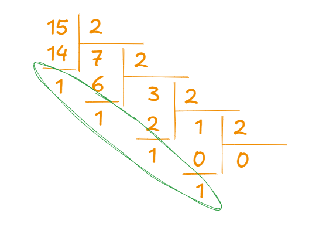
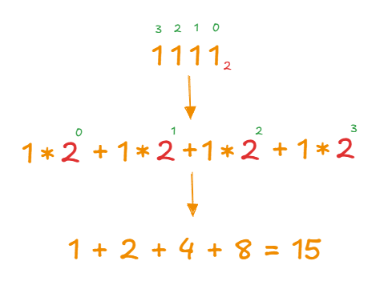

# 5 задание ЕГЭ информатика

## Темы, которые надо знать

- [Строки и операции с ними](../../python/strings)
- Работа с системами счисления
- [Условные конструкции](../../python/ifelifelse)
- [Циклы](../../python/loops)


### Работа с системами счисления

Рассмотрим перевод из 10 СС в 2 СС


Для перевода в другую СС будем делить число на основание СС до тех пор, пока не дойдем до нуля



Все остатки от деления записываем справа налево и получаем `1111`

Выполним обратный перевод
справа налево раставляем разряды начиная с нуля (зеленые цифры). Каждый разряд умножаем на основание СС в степени числа разряда



Теперь реализуем этот алгоритм на языке python

## Перевод в систему меньше `10`

Если система счисления **меньше `10`** (например, троичная `3`-СС), можно использовать такой алгоритм:

```python
def f(n):
    result = ""
    while n > 0:
        result = str(n % 3) + result  # Добавляем остаток в виде строки
        n //= 3  # Делим число на основание системы
    return result

n = 25
print(f(n))  # '221'
```

### Разбор работы функции

1. **Создаем пустую строку `result`**, куда будем записывать цифры нового числа.
2. **Входим в цикл, пока `n > 0`**:
   - Вычисляем остаток от деления `n % base` (цифра в новой системе счисления).
   - Преобразуем остаток в строку и добавляем в начало `result`.
   - Делим `n` на `base` (целочисленное деление `//`), уменьшая значение числа.
3. **Возвращаем `result`**, содержащее итоговое представление числа в новой системе.

## Перевод в произвольную систему счисления

Для перевода в любую **нестандартную** систему (например, `25`-СС), можно использовать следующий алгоритм:

```python
def f(n):
    result = ""
    alp = '0123456789ABCDEFGHIJKLMNO'  # Символы для представления чисел
    while n > 0:
        result = alp[n % 25] + result  # Добавляем остаток деления
        n //= 25  # Целочисленное деление
    return result

n = 1000
print(f(n))  # '1G0'
```

### Разбор работы функции

1. **Создаем пустую строку `result`**, которая будет хранить итоговое представление числа в новой системе счисления.
2. **Определяем алфавит `alp`**, содержащий символы для записи чисел в различных системах (до `25`-СС).
3. **Входим в цикл**, пока `n > 0`:
   - Берем остаток от деления `n % base` и находим соответствующий символ в `alp`.
   - Добавляем этот символ в начало `result` (конкатенация строк).
   - Делим `n` на `base` (целочисленное деление `//`), уменьшая его значение.
4. **Возвращаем `result`**, которое содержит число в новой системе счисления.

## Встроенные функции для перевода чисел

Python предоставляет три стандартные функции для конвертации десятичных чисел в **двоичную**, **восьмеричную** и **шестнадцатеричную** системы счисления:

- **`bin(n)`** — перевод в двоичную систему (`2`-СС)
- **`oct(n)`** — перевод в восьмеричную систему (`8`-СС)
- **`hex(n)`** — перевод в шестнадцатеричную систему (`16`-СС)

Пример использования:

```python
n = 255
print(bin(n))  # '0b11111111'
print(oct(n))  # '0o377'
print(hex(n))  # '0xff'
```

## Функция `int()` для преобразования чисел

Функция `int()` позволяет преобразовывать строки, содержащие числа в различных системах счисления, в десятичный формат.

### Основной синтаксис
```python
int(строка, основание)
```
- Первый аргумент — строка, содержащая число.
- Второй аргумент (необязательный) — основание системы счисления (по умолчанию `10`).

### Примеры использования

Перевод чисел из различных систем в десятичную:

```python
print(int("1010", 2))   # 10 (из двоичной)
print(int("377", 8))    # 255 (из восьмеричной)
print(int("FF", 16))    # 255 (из шестнадцатеричной)
print(int("1G0", 25))   # 1000 (из 25-ричной)
```

### Особенности
- Основание должно быть в диапазоне от `2` до `36`.
- Используются цифры `0-9` и буквы `A-Z` для представления чисел в системах выше десятичной.
- Работает только со строками, а не с числами в другой системе счисления напрямую.