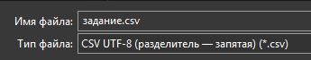

# 5 задание ЕГЭ информатика

## Темы, которые надо знать

- Перевод файла в csv формат
- Построчное считывание файла
- [Работа со списками](../../python/lists)
- [Работа со строками](../../python/strings)
- [Циклы](../../python/loops)


### Перевод файла в csv формат

Для того чтобы преобразовать .xlsx формат в .csv необходимо открыть файл -> файл -> сохранить как -> выбрать тип файла CSV UTF-8 (Разделитель - запятая) (*.csv) или другой похожий формат с разделителем




После сохранения у вас будет файл в формате .csv

### Построчное считывание файла

Для считываания строки можно использовать следующий подход

```python
f = open('example.csv')

for line in f:
    a = line.strip().split(';')
```

Конструкция `f = open('example.csv'){:python}` записывает все содержимое в переменную f

С помощью цикла мы пробегаемся по файлу и составляем список элементов через метод `split(){:python}`, а так же применяем метод `strip(){:python}` для удаления символов переноса

В итоге мы получаем:

```
['35', '11', '6', '43', '1', '25', '13']
['42', '21', '23', '9', '28', '2', '44']
['46', '47', '15', '13', '38', '45', '20']
['43', '20', '5', '4', '27', '41', '44']
...
```


